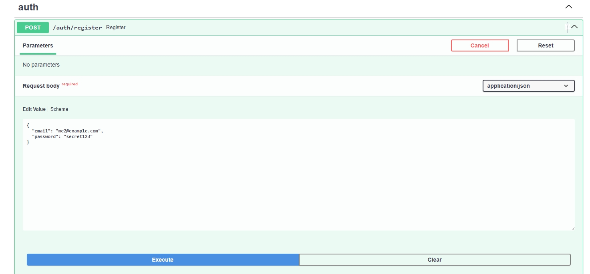
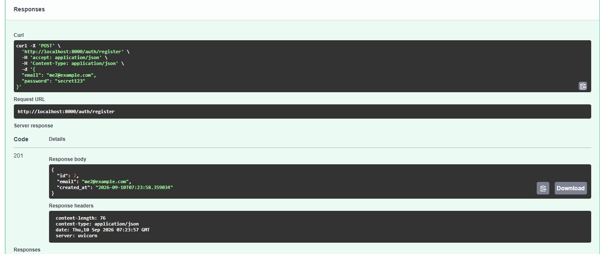
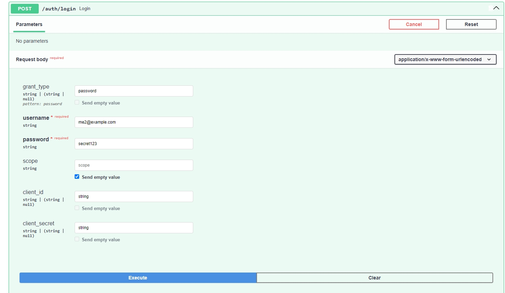
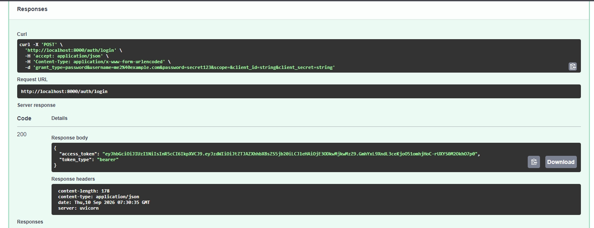
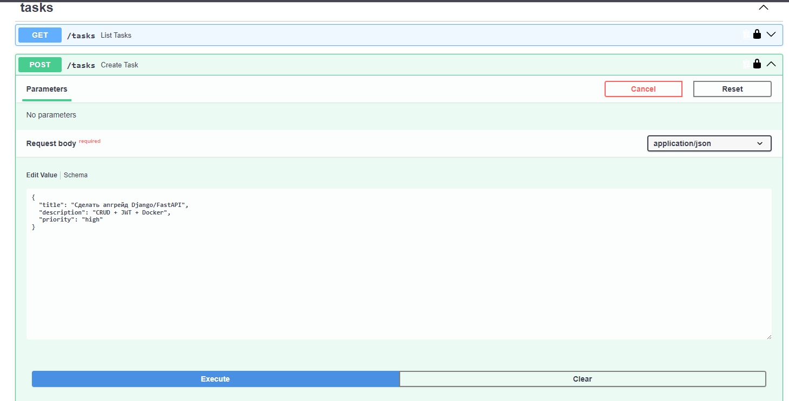
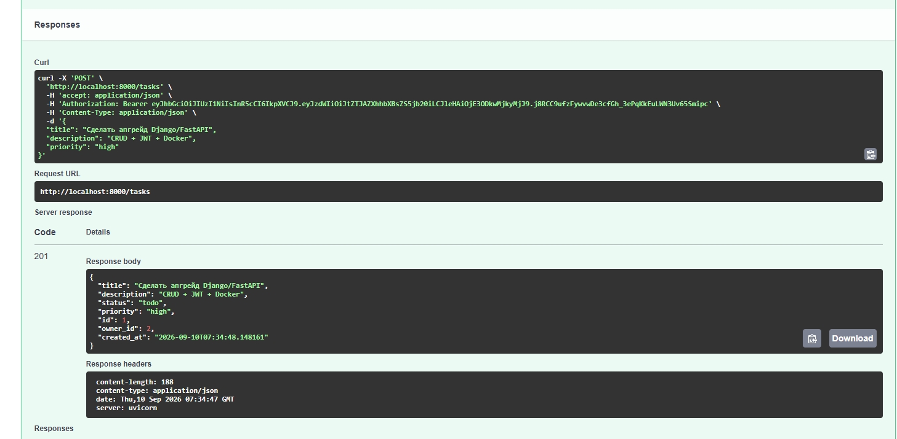

# Task Tracker API

[](https://www.python.org/)
[](https://fastapi.tiangolo.com/)
[](https://www.postgresql.org/)
[](https://www.sqlalchemy.org/)
[](https://alembic.sqlalchemy.org/)
[](https://www.docker.com/)
[](https://jwt.io/)
[](https://github.com/SmailsZX/task-tracker-api/actions/workflows/tests.yml)

REST API для управления задачами с JWT-авторизацией. Учебный пет-проект: написан за один вечер, чтобы показать уверенное владение FastAPI, SQLAlchemy 2.0, PostgreSQL и Docker.

---

## ✨ Возможности

- 🔐 **JWT-авторизация** — регистрация, логин, защищённые эндпоинты
- 👤 **Привязка задач к пользователю** — каждый видит только свои задачи
- 📝 **Полный CRUD** — создание, чтение, обновление, удаление задач
- 🔍 **Фильтры и пагинация** — по статусу, приоритету, `skip`/`limit`
- 🗄 **PostgreSQL 16** через SQLAlchemy 2.0 (typed Mapped API)
- 🔄 **Alembic** — миграции схемы БД
- 🐳 **Docker + docker-compose** — запуск одной командой
- 📖 **Автогенерируемая документация** — Swagger UI из коробки
- 🧪 **13 тестов (pytest)** — авторизация и CRUD
- ⚙️ **CI/CD (GitHub Actions)** — автозапуск тестов

---

## 🛠 Стек

| Слой | Технология |
|------|-----------|
| Web-фреймворк | FastAPI 0.115 |
| ORM | SQLAlchemy 2.0 |
| Миграции | Alembic 1.14 |
| База данных | PostgreSQL 16 |
| Валидация | Pydantic v2 + pydantic-settings |
| Аутентификация | JWT (python-jose) + bcrypt (passlib) |
| ASGI-сервер | Uvicorn |
| Тестирование | pytest 8.3 + httpx |
| CI/CD | GitHub Actions |
| Контейнеризация | Docker + docker-compose |

---

## 🚀 Быстрый старт

### Требования
- Docker Desktop
- Git

### Запуск

```bash
git clone https://github.com/SmailsZX/task-tracker-api.git
cd task-tracker-api
cp .env.example .env
docker compose up --build
```

Через 1–2 минуты API будет доступен:

- 📖 **Swagger UI** — http://localhost:8000/docs
- 📄 **ReDoc** — http://localhost:8000/redoc
- ❤️ **Healthcheck** — http://localhost:8000/health

---

## 🗄 Миграции (Alembic)

Проект использует **Alembic** для управления схемой БД.

### Применить миграции

```bash
alembic upgrade head
```

### Создать новую миграцию

После изменения моделей (`app/models.py`):

```bash
alembic revision --autogenerate -m "описание изменений"
alembic upgrade head
```

### Откатить

```bash
alembic downgrade -1    # на одну миграцию назад
alembic downgrade base  # откатить всё
```

### Структура

```
alembic/
├── versions/           # Файлы миграций
└── env.py              # Конфигурация (URL из .env)
```

---

## 🧪 Тесты

Проект покрыт тестами (pytest) — **13 тестов**.

### Запуск

```bash
pytest tests/ -v
```

### Что покрыто

**Авторизация (`tests/test_auth.py`):**
- ✅ Регистрация пользователя
- ✅ Регистрация с дублирующимся email
- ✅ Успешный логин (JWT)
- ✅ Логин с неверным паролем
- ✅ Получение текущего пользователя (`/auth/me`)
- ✅ Доступ без токена (401)

**Задачи (`tests/test_tasks.py`):**
- ✅ Создание задачи
- ✅ Получение списка задач
- ✅ Фильтрация по статусу
- ✅ Обновление задачи (PATCH)
- ✅ Удаление задачи
- ✅ Задача не найдена (404)
- ✅ Доступ без токена (401)

### Как устроены тесты

- **SQLite в памяти** — тесты не зависят от PostgreSQL.
- **Фикстуры** (`conftest.py`):
  - `client` — тестовый клиент с чистой БД для каждого теста.
  - `auth_client` — клиент с JWT-токеном.
- **Изоляция** — каждый тест получает чистую БД.

### Пример

```python
def test_create_task(auth_client):
    response = auth_client.post(
        "/tasks",
        json={"title": "Тестовая задача", "priority": "high"},
    )
    assert response.status_code == 201
    assert response.json()["title"] == "Тестовая задача"
```

---

## 📸 Скриншоты

### Регистрация




### Логин и получение JWT




### Создание задачи (защищённый эндпоинт)




---

## 🌐 API Endpoints

### Auth

| Метод | Путь | Описание | Auth |
|-------|------|----------|:----:|
| `POST` | `/auth/register` | Регистрация нового пользователя | ❌ |
| `POST` | `/auth/login` | Получить JWT-токен | ❌ |
| `GET` | `/auth/me` | Информация о текущем пользователе | 🔒 |

### Tasks

| Метод | Путь | Описание | Auth |
|-------|------|----------|:----:|
| `GET` | `/tasks` | Список задач (фильтры, пагинация) | 🔒 |
| `POST` | `/tasks` | Создать задачу | 🔒 |
| `GET` | `/tasks/{id}` | Получить задачу по ID | 🔒 |
| `PATCH` | `/tasks/{id}` | Обновить задачу | 🔒 |
| `DELETE` | `/tasks/{id}` | Удалить задачу | 🔒 |

### Meta

| Метод | Путь | Описание |
|-------|------|----------|
| `GET` | `/health` | Healthcheck |

**Параметры фильтрации `GET /tasks`:**

- `status` — `todo` / `in_progress` / `done`
- `priority` — `low` / `medium` / `high`
- `skip` — пропустить N записей (по умолчанию 0)
- `limit` — вернуть N записей (по умолчанию 20, максимум 100)

---

## 🧪 Примеры запросов

### Регистрация

```bash
curl -X POST http://localhost:8000/auth/register \
  -H "Content-Type: application/json" \
  -d '{"email":"user@example.com","password":"secret123"}'
```

### Логин

```bash
curl -X POST http://localhost:8000/auth/login \
  -H "Content-Type: application/x-www-form-urlencoded" \
  -d "username=user@example.com&password=secret123"
```

Ответ:
```json
{
  "access_token": "eyJhbGciOiJIUzI1NiIsInR5cCI6IkpXVCJ9...",
  "token_type": "bearer"
}
```

### Создание задачи

```bash
TOKEN="вставь access_token сюда"

curl -X POST http://localhost:8000/tasks \
  -H "Authorization: Bearer $TOKEN" \
  -H "Content-Type: application/json" \
  -d '{"title":"Сделать апгрейд","description":"FastAPI + JWT + Docker","priority":"high"}'
```

### Список задач с фильтром

```bash
curl "http://localhost:8000/tasks?status=todo&priority=high&limit=10" \
  -H "Authorization: Bearer $TOKEN"
```

---

## 🏗 Структура проекта

```
task-tracker-api/
├── app/
│   ├── main.py              # Точка входа FastAPI
│   ├── config.py            # Настройки через pydantic-settings
│   ├── database.py          # Engine, SessionLocal, Base
│   ├── models.py            # SQLAlchemy-модели (User, Task)
│   ├── schemas.py           # Pydantic-схемы
│   ├── security.py          # bcrypt + JWT-хелперы
│   ├── deps.py              # Зависимости (get_db, get_current_user)
│   └── routers/
│       ├── auth.py          # /auth/*
│       └── tasks.py         # /tasks/*
├── alembic/                 # Миграции (Alembic)
│   ├── versions/            # Файлы миграций
│   └── env.py               # Конфигурация
├── tests/                   # Тесты (pytest)
│   ├── conftest.py
│   ├── test_auth.py
│   └── test_tasks.py
├── .github/workflows/       # CI (GitHub Actions)
│   └── tests.yml
├── docs/                    # Скриншоты Swagger UI
├── Dockerfile
├── docker-compose.yml
├── alembic.ini
├── requirements.txt
├── .env.example
└── README.md
```

---

## 🔒 Безопасность

- Пароли хешируются **bcrypt** (не sha256 — медленный + salt из коробки)
- JWT содержит `sub` (email) и `exp` (60 минут по умолчанию)
- `SECRET_KEY` вынесен в переменные окружения (`.env` в `.gitignore`)
- Все защищённые эндпоинты требуют `Authorization: Bearer <token>`
- Пользователь видит и редактирует **только свои** задачи (`owner_id == current_user.id`)

---

## 🔮 Roadmap

- [x] **pytest + httpx** — тесты на auth и CRUD (13 тестов)
- [x] **GitHub Actions** — CI: pytest на каждый push
- [x] **Alembic** — миграции вместо `Base.metadata.create_all`
- [ ] **Пагинация с total** — `{items: [...], total: N}`
- [ ] **Rate limit** на `/auth/login` через slowapi
- [ ] **Refresh-токены** — длинные сессии без релогина

---

## 📝 Заметки

- **Почему `bcrypt==4.0.1`?** `passlib 1.7.4` несовместим с `bcrypt 4.1+` — падает на внутреннем тесте с `ValueError: password cannot be longer than 72 bytes`. Пин версии — самое простое решение. В проде лучше взять `argon2` или валидировать длину пароля в Pydantic-схеме.
- **Alembic и ENUM.** При `alembic downgrade base` ENUM-типы (`taskstatus`, `taskpriority`) **не удаляются** автоматически. Если нужно откатить всё — удали их вручную: `DROP TYPE IF EXISTS taskstatus CASCADE;`

---

## 📄 Лицензия

MIT — используй свободно.